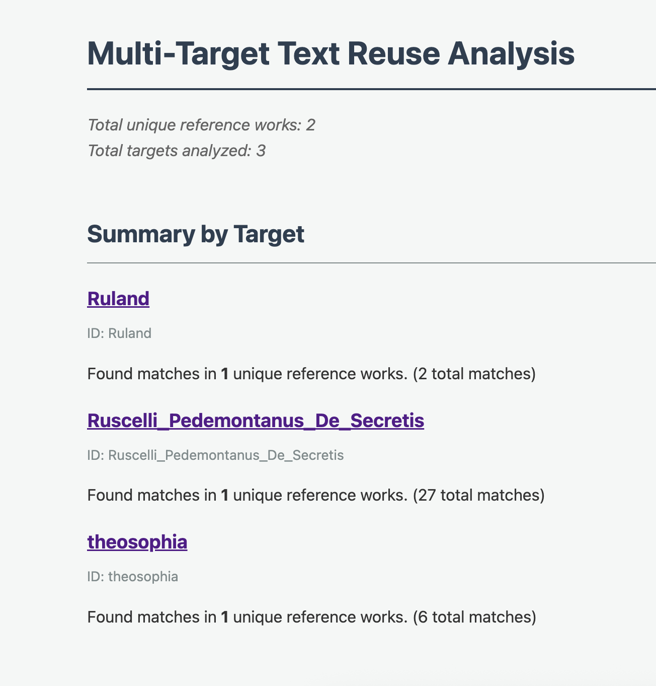
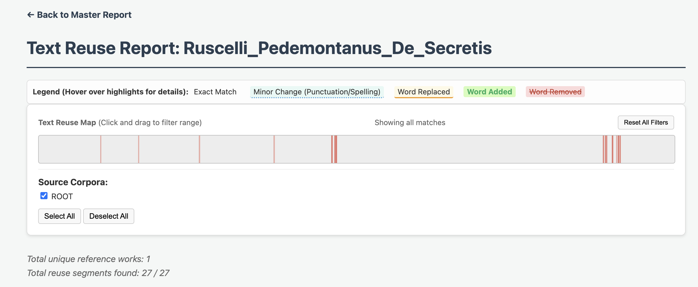
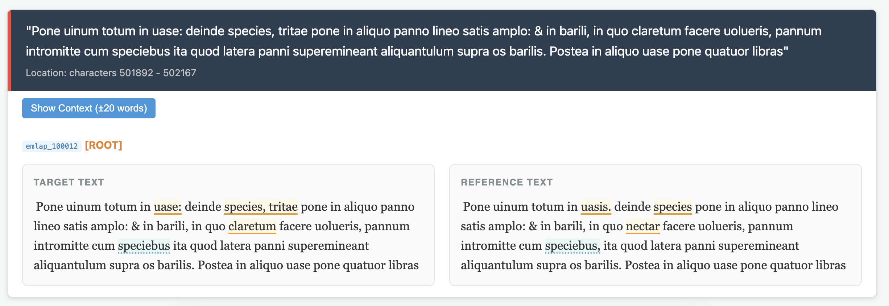

# Text Reuse Analysis Toolkit

A flexible Python-based toolkit for performing large-scale text reuse analysis using Jonathan Reeve's `text-matcher`. This toolkit allows researchers to compare multiple "target" works against a vast "reference" corpus (like the GreLa Latin corpus) to identify citations, parallels, and borrowings with advanced visualization and filtering.

## Project Structure

- `target_texts/`: Place the works you want to analyze here. 
    - Supports `.txt` and `.xml` (TEI-compliant) formats interchangeably.
    - Supports recursive subfolders for organizing different authors or collections.
- `reference_texts/`: Place your reference library here. Subfolders are fully supported.
- `scripts/`: Operational Python scripts for the analysis pipeline.
- `results/`: Output directory for match data, logs, and interactive HTML reports.
- `reference_texts_with_matches/`: Contains copies of only the reference files that had confirmed matches.

## Prerequisites

- Python 3.8+
- Install dependencies using the provided requirements file:
  ```bash
  pip install -r requirements.txt
  ```

## Setup & Usage

### 1. Prepare Target & Reference Texts
Drop your files into the respective `target_texts/` and `reference_texts/` directories.
*(Note: Sample target and reference texts are already included so you can run a test immediately.)*
- **XML Support:** The system automatically parses TEI XML files, extracting text from the `<body>` while handling logical negation symbols (`¬`) and other early modern transcription artifacts.
- **Subfolder Support:** You can organize your files into subfolders; the system uses relative paths as unique identifiers to avoid collisions.

### 2. Run the Analysis Pipeline
Execute the flexible analysis engine to cross-compare all targets against all references:
```bash
python3 scripts/run_flexible_analysis.py
```
*Note: This script uses a tracking log in `results/flexible_run_log.csv`. Only new or modified pairs of files will be processed in subsequent runs.*

### 3. Generate Research Reports
1. **Generate Interactive Reports:** Create individualized HTML reports with advanced visual tools.
   ```bash
   python3 scripts/generate_html_report.py
   ```
2. **Isolate Matched Texts (Optional):** Copy all reference files that contained a match into a separate folder for easy review.
   ```bash
   python3 scripts/copy_matches.py
   ```

## Advanced Visualization Features

Open `results/flexible_reuse_report.html` to access the master dashboard. The individual reports include several advanced tools for researchers:







- **Smart Side-by-Side Diffing:** Matches are displayed in a dual-column format. The text is semantically highlighted to instantly show:
    - Exact Matches (plain text)
    - Minor Orthographic/Punctuation Changes (dotted blue underline)
    - Major Word Replacements (solid yellow underline)
    - Insertions & Deletions (green/red highlights)
- **Hover Tooltips:** Hovering over any highlighted change provides a tooltip explaining the exact textual variation.
- **Toggleable Context Windows:** Click "Show Context" to instantly reveal ~150 characters (±20 words) of surrounding text from both the original target and reference files, allowing you to read the match in its full thematic context without leaving the report.
- **Interactive Barcode Map:** Click and drag on the map at the top of the report to filter matches by their location in the target text.
- **Source Filtering:** Instantly toggle specific corpora or subfolders on or off to filter out self-matches or focus on specific metadata categories.

## Configuration

Sensitivity can be adjusted at the bottom of `scripts/run_flexible_analysis.py`:
- `NGRAM_SIZE`: Length of word sequences for comparison (default: 3).
- `THRESHOLD`: Minimum matching n-grams required (default: 2).
- `CUTOFF`: Minimum total words in a match to be saved (default: 4).
